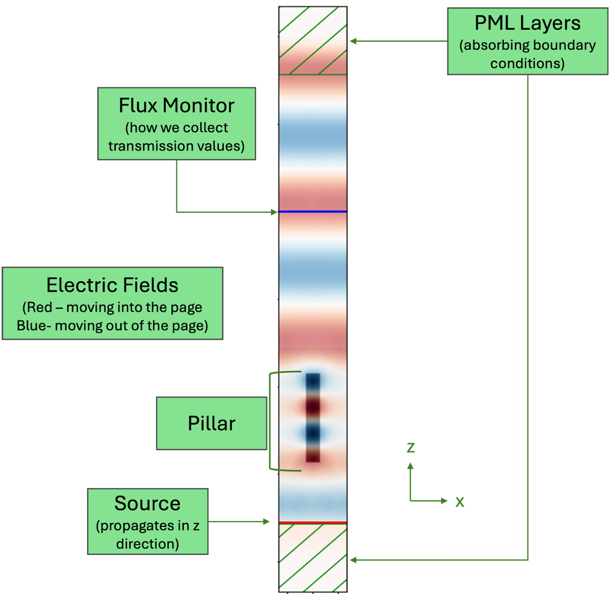

# single_pillar_sim

This experiment lets us characterize a single meta-atom pillar under local phase approximation. We are repeating the experiment conducted in [this journal paper](references/RAEKER_2021.pdf), Fig. 3.

The experiment simulates a high-index meta-atom pillar on top of a glass (fused silica) substrate embedded in PDMS, a flexible plastic material (As modeled in Fig 3.a of the journal paper referenced above). The 3D simulation is run `experiment.num` number of times, with the pillar radius increasing from 75 nm to 250 nm with each iteration.

At the end of each simulation, transmission and phase information are recorded by means of a flux monitor.

### Run the experiment

Create a [fork](https://docs.github.com/en/pull-requests/collaborating-with-pull-requests/working-with-forks/fork-a-repo#forking-a-repository) of this repository. This requires you to have your own GitHub account. Once you've created the fork, you'll need to clone it to your local computer. If you are following the lab's recommended file directory structure, you'll navigate in a terminal to `documents/code` and run
```
git clone {url to your forked repository}
```
Once the repository is cloned, open the file, `single_pillar_sim/configs.yaml`, in an editor and set the following parameters:

    - animate : 0
    - resolution : 20
    
- Dont forget to save if you make any changes (`:w` if you're using the vim editor).

In your terminal, with the `mpi_meep` environment activated (If you haven't followed [this tutorial](https://github.com/Kovaleski-Research-Lab/Global-Lab-Repo/blob/main/sops/meep/get_started_meep.md) yet, stop and do that now),  navigate back to `Gloabl-Lab-Repo/sops/meep/single_pillar` and run
```
python3 main.py -config configs.yaml
```

Once the simulations are finished, the script should display an image showing a snapshot of the final pillar in its simulation environment, with fields shown. It should look somewhat like the image in the figure below, which shows an x-z slice of the 3D simulation cell. The sinusoidal electric field is symbolized by red - negative fields moving into the screen, and blue - positive fields moving out of the screen. The red line represents the source, and the blue line represents the flux monitor (The plane at which we collect phase and transmission information).

Note that there are green diagonal lines on the top and bottom in the z-direction. This represents PML, perfectly matching layers, which are absorbing boundary conditions. In x and y we have repeating boundary conditions. 

Note also that the fields are highly concentrated inside the pillar - This is due to the **resonances** occurring due to the subwavelength nature of the pillars (source wavelength is 1550 nm. Max pillar diameter is 500 nm). The behavior of the plane wave going out of the pillar matches the behavior coming out of it, but a phase shift has occurred.



Next, the script displays an image with the phase and transmission characteristics, which should agree with Fig. 3 of  [the Raeker paper](references/RAEKER_2021.pdf).

- How does phase delay change with pillar radius? Why might this be beneficial?
- Why do you think we want high transmission?

  ## A few things to try while you're exploring this code:

- Change `experiment.animate` to 1. Rerun the script. Now it will display an animation showing the electric field as the wave propagates through the pillar.
- Change `experiment.animate` back to 0. Try changing the resolution to 10 by changing `resolution` in the config file. What happens? Why do you think this is? Now try changing the resolution to 30 or 40. What happens now?
- You can press Ctrl+c to cancel the script if it's taking way too long to run. Running higher resolution simulations gets computationally expensive, so we use parallel meep to speed things up by distributing the computation among multiple CPU cores. To run the script with parallel meep, use:
 
  ```
  mpirun -np {num_cores} python3 main.py -config configs.yaml
  ```
    - If you're not sure how many cores are available, try running `htop` in any terminal.
